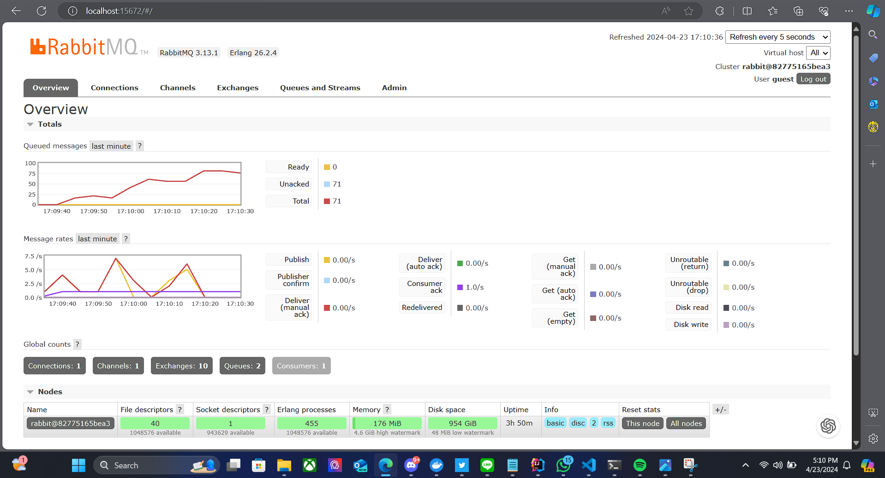

7. Try to answer the following questions, and write the answer in the and new file readme.md in 
you repository.  
- What is amqp?  
AMQP adalah singkatan dari Advanced Message Queuing Protocol. AMQP memungkinkan terjadinya komunikasi secara asinkronus. AMQP dirancang untuk memfasilitasi pertukaran pesan antara aplikasi dengan menyediakan berbagai fitur, seperti antrean pesan, pengalihan, keandalan, dan keamanan. AMQP memungkinkan aplikasi client untuk bisa berkomunikasi dengan aplikasi sumber

- What it means? guest:guest@localhost:5672 , what is the first guest, and what is the second guest, and what is localhost:5672 is for?  
Guest pertama merupakan nama pengguna yang akan mengakses broker AMQP. Guest kedua merupakan kata sandi dari pengguna. "localhost:5672" terdiri dari dua bagian, yaitu "localhost" dan "5672". "5672" menunjukkan nomor port tempat broker AMQP berjalan. "localhost" menunjukkan bahwa hostnya terdapat pada local machine.

Picture of Running RabbitMQ while sending and processing event with sleep:

Gambar diatas menunjukkan adanya banyaknya message yang dikirim oleh publisher. Kita juga dapat melihat bahwa Consumer Ack bernilai 1, yaitu consumer menerima satu message per detik yang disebabkan oleh sleep selama satu detik. Kenaikan message yang dikirim oleh publisher secara masif mengakibatkan penumpukan pada queue karena subscriber hanya bisa menerima satu message per detik.

Picture of Running RabbitMQ while sending and processing event with sleep and three subscribers:

Lima output console terakhir dari subscriber 1:

Lima output console terakhir dari subscriber 2:

Lima output console terakhir dari subscriber 3:

Dari beberapa screenshot diatas, kita dapat melihat bahwa penurunan queue dapat dilakukan dengan lebih cepat karena adanya semakin banyak subscriber membantu mempercepat dequeue dari message queue. Hal ini terjadi karena masing-masing subscriber melakukan dequeue nya sendiri setiap satu detik. Hal ini dibuktikan dengan adanya output console yang berbeda dari masing-masing subscriber.